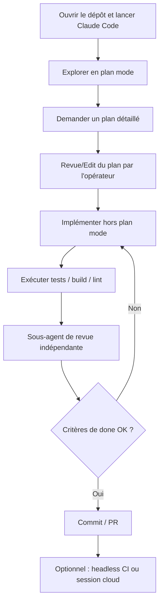
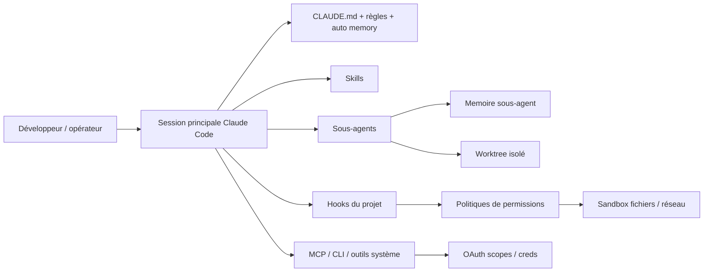

# Recherche approfondie sur Anthropic Claude Code

## Résumé exécutif

Claude Code n’est pas simplement une interface de chat pour le code : c’est un **harnais agentique** autour de Claude qui fournit la boucle d’exécution, les outils, la gestion du contexte et l’environnement opératoire nécessaires pour lire des fichiers, lancer des commandes, modifier un dépôt, utiliser des intégrations et itérer jusqu’à ce qu’une tâche soit terminée. Anthropic recommande un flux de travail très net : **explorer**, **planifier**, **implémenter**, **vérifier**, puis **committer / ouvrir une PR**. Cette séparation est centrale parce que la qualité chute quand l’agent code trop tôt ou quand le contexte se remplit d’exploration non structurée. citeturn7view1turn29view2turn11view0turn28view0

Sur le plan de l’architecture de configuration, trois idées dominent. D’abord, `CLAUDE.md` sert à encoder le contexte persistant et les conventions du projet, mais Anthropic conseille de le garder **court, spécifique et structuré**, idéalement sous ~200 lignes par fichier. Ensuite, les **skills** portent les procédures réutilisables et ne sont chargées **qu’au moment où elles sont invoquées**, ce qui réduit fortement le coût contextuel des longues checklists. Enfin, les **sous-agents** servent à isoler les tâches latérales bruyantes ou spécialisées, avec leur propre fenêtre de contexte, leur propre prompt système et leurs propres permissions. citeturn10view0turn10view3turn12view0turn13view1turn35search0

Pour la sûreté d’exploitation, Claude Code combine plusieurs couches : modes de permissions, règles allow/ask/deny, hooks déterministes, sandbox OS, restrictions réseau / fichiers, configurations gérées et, côté MCP, limitation des scopes OAuth. Le point important est que **les permissions sont appliquées par Claude Code et non par le modèle** ; une instruction dans le prompt ou dans `CLAUDE.md` ne suffit donc pas à créer, retirer ou contourner un droit. C’est précisément cette séparation entre guidance et enforcement qui rend possible un design “least privilege”. citeturn9view0turn26view0turn9view2turn24view0turn3view9

Ma recommandation synthétique pour un cours ou un déploiement en équipe est la suivante : mettre les **faits stables** dans `CLAUDE.md`, les **procédures réutilisables** dans `.claude/skills/`, les **contrôles obligatoires** dans les hooks, les **experts spécialisés** dans `.claude/agents/`, et réserver les **worktrees** aux tâches parallèles ou aux sous-agents qui écrivent. Cette répartition suit très directement la conception officielle de Claude Code et réduit à la fois le bruit contextuel, la fatigue d’approbation et les conflits Git. citeturn19view0turn7view4turn36view2turn17view0turn34view0

## Workflow complet pas à pas

Le flux minimal officiel commence par l’installation, la connexion, l’ouverture d’une session dans un dépôt, une phase de questions pour comprendre le codebase, puis une première modification, des opérations Git conversationnelles et enfin l’usage de workflows courants comme refactor, tests, documentation et revue. Claude Code peut être utilisé en terminal interactif, en mode one-shot, en mode non interactif `-p`, dans les IDE, dans le navigateur et dans CI/CD. citeturn28view0turn7view7

Le flux **recommandé** par Anthropic pour un vrai travail de développement est plus structuré :  
exploration du code en mode plan, création d’un plan explicite, implémentation hors plan mode, puis commit / PR. Anthropic insiste sur le fait qu’un agent qui saute directement au code a tendance à résoudre le mauvais problème. Le mode plan est particulièrement utile quand le changement touche plusieurs fichiers ou quand l’opérateur connaît mal la zone du code. citeturn29view2

Anthropic recommande aussi de toujours donner à Claude un **mécanisme de vérification** qu’il peut exécuter : suite de tests, build, lint, diff attendu, voire capture d’écran. Sans boucle de vérification exécutable, l’agent s’arrête quand “ça a l’air bon”, et l’humain redevient le validateur principal. L’idée opératoire n’est donc pas seulement “faire modifier du code”, mais “faire fermer la boucle avec une preuve de réussite”. citeturn11view0

Pour les tâches longues ou répétitives, Claude Code se prolonge naturellement en **mode non interactif**, en exécution batch, en sessions parallèles, ou en mode auto avec classifieur de sécurité en arrière-plan. Anthropic recommande en outre une **revue antagoniste** par sous-agent sur le diff final, afin qu’un second contexte inspecte le résultat sans être contaminé par les hypothèses de l’implémentation initiale. citeturn11view4turn11view5turn10view7

Le workflow end-to-end le plus pédagogique pour des développeurs et des opérateurs est donc celui-ci : démarrer une session, comprendre la zone du dépôt, faire produire un plan, valider le plan, exécuter, laisser Claude tester, lancer une revue indépendante, puis seulement ensuite préparer le commit ou la PR. Ce flux est cohérent avec la quickstart officielle, avec les best practices d’Anthropic et avec leur usage interne des agents plus autonomes. citeturn28view0turn29view2turn21search8turn21search16

Le diagramme ci-dessous synthétise ce flux recommandé. Il est dérivé de la quickstart, des best practices et des pages “How Claude Code works” et “Run Claude Code programmatically”. citeturn28view0turn29view2turn7view1turn7view7



En pratique, le “workflow opérateur” diffère légèrement du “workflow développeur”. Le développeur agit surtout sur le **quoi** et sur les critères de done. L’opérateur, lui, choisit le **mode de permissions**, arbitre les escalades, observe les outputs, peut interrompre la session, relancer un sous-agent, rejouer une session avec `/resume` ou basculer en mode non interactif pour industrialiser une tâche reproductible. Cette distinction “humain = intention / agent = exécution instrumentée” apparaît aussi dans les analyses récentes d’Anthropic sur l’usage réel de Claude Code. citeturn9view1turn11view4turn15view0turn21search16

## Brouillon de CLAUDE.md

Chaque session Claude Code démarre avec une nouvelle fenêtre de contexte. Deux mécanismes transportent de la connaissance d’une session à l’autre : **les fichiers `CLAUDE.md` rédigés par l’humain** et **l’auto memory rédigée par Claude**. `CLAUDE.md` sert à guider le comportement, les conventions et l’architecture ; l’auto memory capture plutôt des apprentissages et préférences observés par Claude. Les deux sont du **contexte**, pas une politique dure. Si vous voulez empêcher une action, il faut passer par des règles de permission ou un hook. citeturn10view0turn35search1

Les emplacements de `CLAUDE.md` sont hiérarchiques : politique gérée au niveau organisation, instructions utilisateur dans `~/.claude/CLAUDE.md`, instructions projet dans `./CLAUDE.md` ou `./.claude/CLAUDE.md`, et fichiers plus spécifiques chargés à la demande dans les sous-répertoires. Anthropic recommande de s’en servir pour ce que vous réexpliquez autrement à chaque session : commandes de build, conventions, architecture, workflows de review, règles de sécurité et style de code. Les imports `@path/to/file` sont pris en charge, avec expansion récursive limitée à quatre niveaux. `/init` peut générer un premier brouillon de `CLAUDE.md`, et un `AGENTS.md` existant peut être importé ou même symlinké. citeturn10view0turn10view1

Le point le plus important, pédagogiquement, est de **ne pas transformer `CLAUDE.md` en roman**. Anthropic vise plutôt un fichier bref, ciblé, orienté faits stables. Les procédures longues doivent migrer vers des skills. Les règles strictes et répétables doivent migrer vers des hooks. Cela évite le “contexte boursouflé” que les best practices identifient comme un facteur direct de dégradation. citeturn10view0turn11view0turn29view3

Le tableau suivant synthétise les fichiers qu’il est pertinent de créer dans un projet sérieux, à partir de la structure officielle `.claude`, de la hiérarchie mémoire et du mécanisme worktree. citeturn19view0turn10view0turn34view0turn33view6

| Fichier / dossier | Rôle | Portée recommandée | À versionner |
|---|---|---|---|
| `CLAUDE.md` | conventions du projet, architecture, commandes clés, critères de done | projet | oui |
| `CLAUDE.local.md` | préférences personnelles locales | projet local | non |
| `.claude/settings.json` | permissions, hooks, sandbox, env, plugins | projet partagé | oui |
| `.claude/settings.local.json` | overrides machine / worktree / expérimentations | local | non |
| `.claude/rules/*.md` | règles thématiques ou path-scoped | projet / utilisateur | oui |
| `.claude/skills/<name>/SKILL.md` | procédures réutilisables, commandes slash, knowledge packs | projet / utilisateur | oui |
| `.claude/agents/*.md` | sous-agents spécialisés | projet / utilisateur | oui |
| `.claude/agent-memory/<agent>/MEMORY.md` | mémoire persistante d’un sous-agent | projet | oui si utile à l’équipe |
| `.claude/agent-memory-local/<agent>/MEMORY.md` | mémoire locale non partagée | local | non |
| `.mcp.json` | MCP partagés du projet | projet | oui |
| `.worktreeinclude` | copie contrôlée des fichiers gitignored vers les worktrees | projet | oui |

Voici un **brouillon analytique de `CLAUDE.md`** que je recommande pour un dépôt d’équipe. C’est une adaptation de la logique officielle Anthropic, pas une citation mot à mot. Il s’appuie sur la hiérarchie mémoire, les bonnes pratiques de promptage et la séparation “faits / procédures / contraintes déterministes”. citeturn10view0turn11view1turn29view2

```md
# Contexte projet

## Mission
- Objectif produit :
- Utilisateurs principaux :
- Définition de "terminé" pour ce dépôt :

## Stack et commandes
- Installer : `...`
- Lancer : `...`
- Tester : `...`
- Lint : `...`
- Typecheck : `...`
- Build : `...`

## Répertoires importants
- `src/...` :
- `tests/...` :
- `docs/...` :
- `infra/...` :

## Architecture
- Décisions structurantes :
- Patterns à suivre :
- Anti-patterns à éviter :
- Bibliothèques préférées / interdites :

## Règles de code
- Style :
- Gestion d'erreurs :
- Logging :
- Validation entrées/sorties :
- Tests exigés pour toute modification :

## Workflow agentique attendu
- Commencer par explorer avant de coder.
- Produire un plan pour tout changement multi-fichiers.
- Vérifier via tests/build/lint avant de conclure.
- Utiliser un sous-agent pour revue indépendante sur les diffs importants.
- Ouvrir une PR avec résumé + risques + plan de rollback si pertinent.

## Sécurité et permissions
- Ne jamais lire : `.env`, secrets, credentials, exports clients.
- Demander confirmation avant toute action réseau non standard.
- Ne pas modifier l'infra CI/CD sans plan explicite.

## Quand utiliser quoi
- Faits stables -> `CLAUDE.md`
- Procédure réutilisable -> skill
- Contrôle obligatoire -> hook
- Tâche spécialisée / bruyante -> sous-agent

## Format de réponse préféré
- Donner d'abord le plan court.
- Citer les fichiers impactés.
- Montrer la preuve de vérification.
- Signaler explicitement les risques restants.
```

Une déclinaison encore meilleure consiste à garder `CLAUDE.md` court puis à importer des fichiers thématiques, par exemple un guide Git, un guide d’architecture et un guide de sécurité. Les commentaires HTML de maintenance peuvent aussi être ajoutés sans être injectés dans le contexte au lancement, ce qui permet de documenter le fichier pour les humains sans payer ce coût en tokens. citeturn10view0

## Patterns techniques pour skills, hooks et sous-agents

Les trois primitives ne servent pas au même niveau du système. Les **skills** sont des paquets de savoir-faire ou de procédure chargés à la demande. Les **hooks** sont des contrôles et automatisations déterministes branchés sur le cycle de vie. Les **sous-agents** sont des exécuteurs spécialisés en contexte isolé. Anthropic les présente comme complémentaires, et non substituables. citeturn7view3turn7view4turn35search0

### Skills

Une skill est définie par un répertoire et un `SKILL.md`. Le nom de la commande vient du nom du dossier, tandis que la `description` sert à la découverte automatique par Claude. Les skills suivent le standard ouvert **Agent Skills**, avec des extensions propres à Claude Code pour le contrôle d’invocation, l’exécution en subagent et l’injection de contexte dynamique. Elles peuvent être invoquées automatiquement ou directement via `/skill-name`. Leur intérêt principal est économique : contrairement à `CLAUDE.md`, leur corps ne s’injecte pas au démarrage de chaque session. citeturn12view0turn7view3

La structure est simple : frontmatter YAML + contenu Markdown. Le frontmatter peut gérer l’invocation, les outils préautorisés, le mode isolé `context: fork`, les arguments et la visibilité. Anthropic a aussi fusionné les anciennes commandes personnalisées dans le système des skills ; un fichier `.claude/commands/deploy.md` et un skill `.claude/skills/deploy/SKILL.md` produisent le même `/deploy`. citeturn12view0turn13view1

Exemple de skill de procédure, adapté de la doc officielle. citeturn13view2turn13view3

```md
---
description: Prépare un commit propre et traçable pour les changements courants
disable-model-invocation: true
allowed-tools: Bash(git status *) Bash(git add *) Bash(git commit *)
---

Prépare un commit à partir du diff courant.

1. Résume les changements.
2. Vérifie s'il manque des tests ou un changelog.
3. Propose un message Conventional Commit.
4. Stage uniquement les fichiers pertinents.
5. Commits si tout est cohérent.
```

Les **arguments** sont disponibles via `$ARGUMENTS`, `$ARGUMENTS[n]` ou `$0`, `$1`, etc. Les skills peuvent aussi injecter du **contexte dynamique** via des blocs shell exécutés avant que Claude ne lise le contenu, par exemple pour inline un `git diff` ou l’état d’un repo. Et si vous mettez `context: fork`, le contenu du skill devient le prompt d’un sous-agent isolé, ce qui transforme une procédure lourde en tâche séparée. citeturn12view4turn12view6turn13view3

Deux détails d’architecture méritent d’être enseignés. D’une part, après compaction, Claude Code réinjecte les skills invoquées les plus récentes mais avec un plafond de **5 000 tokens par skill** et **25 000 tokens au total** ; une skill trop volumineuse peut donc cesser d’influencer la session si elle n’est pas réinvoquée. D’autre part, `allowed-tools` préapprouve les outils listés pendant la durée d’activation de la skill, mais ne retire pas les autres outils ; pour cela, il faut utiliser `disallowed-tools` ou les règles globales de permission. citeturn13view2

### Hooks

Les hooks sont des commandes shell, prompts, agents, requêtes HTTP ou appels MCP déclenchés à des moments précis du cycle de vie. Leur fonction est déterministe : formater, notifier, bloquer une commande, faire respecter une règle de projet, réagir à une compaction, intercepter une demande de permission, ou gérer un worktree. Anthropic les oppose explicitement aux comportements “laissés au LLM” : si une règle doit arriver **à coup sûr**, elle doit être exprimée en hook. citeturn7view4turn15view5

L’éventail d’événements est très large. On retrouve notamment `SessionStart`, `UserPromptSubmit`, `PreToolUse`, `PermissionRequest`, `PostToolUse`, `Notification`, `SubagentStart`, `SubagentStop`, `PreCompact`, `PostCompact`, `Elicitation`, `ConfigChange`, `WorktreeCreate` et `WorktreeRemove`. Cette richesse est un point fort majeur de Claude Code par rapport à des assistants plus purement conversationnels. citeturn16view0turn16view1turn16view2turn16view3turn16view6turn16view8turn16view9

`PermissionRequest` est particulièrement puissant : il peut **autoriser**, **refuser**, **modifier l’entrée** d’un outil ou **mettre à jour les permissions**. `PreToolUse` sert mieux à bloquer ou réécrire avant exécution. `PostToolUse` sert à enrichir ou redacter le résultat retourné à Claude. Et `Notification` sert aux effets de bord non bloquants, par exemple relayer les alertes vers un autre canal. citeturn15view7turn16view1turn16view2turn16view3

Exemple minimal de hook projet pour interdire l’édition sur `main` et lancer un lint après écriture. C’est une synthèse des modèles officiels et d’exemples communautaires. citeturn7view4turn32view5

```json
{
  "hooks": {
    "PreToolUse": [
      {
        "matcher": "Edit|Write",
        "hooks": [
          {
            "type": "command",
            "command": "[ \"$(git branch --show-current)\" != \"main\" ] || { echo '{\"hookSpecificOutput\":{\"hookEventName\":\"PreToolUse\",\"decision\":{\"behavior\":\"deny\",\"message\":\"Interdit de modifier directement main\"}}}' ; exit 0; }"
          }
        ]
      }
    ],
    "PostToolUse": [
      {
        "matcher": "Edit|Write",
        "hooks": [
          {
            "type": "command",
            "command": "./scripts/run-lint.sh"
          }
        ]
      }
    ]
  }
}
```

Un point souvent méconnu : les hooks peuvent aussi être déclarés **dans les skills et dans les sous-agents**, avec une portée limitée à leur cycle de vie. Pour les sous-agents, un hook `Stop` défini en frontmatter est automatiquement converti en `SubagentStop`. Cette capacité permet de faire de la politique “contextuelle” : par exemple, un agent de review qui active un hook de lint uniquement quand lui-même travaille. citeturn15view5turn15view9turn36view3

### Sous-agents

Les sous-agents sont des assistants spécialisés, définis dans `~/.claude/agents/` ou `.claude/agents/`, avec frontmatter YAML et prompt système Markdown. Ils possèdent **leur propre fenêtre de contexte**, reçoivent seulement leur prompt système et quelques détails d’environnement, et peuvent avoir leurs propres outils, modèle, mémoire, hooks, permissions et stratégie d’isolation. Anthropic recommande de les utiliser quand une sous-tâche générerait beaucoup de logs, de lectures de fichiers ou de résultats intermédiaires qui pollueraient la conversation principale. citeturn35search0turn36view0

Exemple de sous-agent spécialisé, compatible avec la logique officielle. citeturn36view0turn36view1turn36view2

```md
---
name: security-reviewer
description: Revue sécurité des diffs et des chemins sensibles
tools: Read, Glob, Grep, Bash, Skill
permissionMode: plan
skills:
  - api-conventions
  - error-handling-patterns
memory: project
isolation: worktree
---

Tu es un reviewer sécurité.

Objectif :
- inspecter les changements pour authn/authz, injections, secrets, accès fichiers
- citer les fichiers concernés
- proposer seulement des remédiations concrètes
- ne pas modifier le code sans demande explicite
```

Le modèle d’exécution est subtil. Les sous-agents peuvent tourner au premier plan ou en arrière-plan ; depuis Claude Code v2.1.198, l’arrière-plan est devenu le comportement par défaut lorsqu’Anthropic juge que la tâche n’a pas besoin d’un résultat immédiat. Les prompts de permission remontent vers la session principale avec le nom du sous-agent demandeur. Un sous-agent peut aussi être **enchaîné** à un autre : le premier renvoie une synthèse, que Claude transmet au suivant dans la conversation principale. citeturn36view4turn36view5

En communication, le pattern le plus important est `SendMessage`. Un sous-agent terminé peut être repris avec son contexte antérieur ; Claude utilise `SendMessage` vers l’ID ou le nom de l’agent pour le relancer. Il existe aussi un **limite de profondeur** : à profondeur cinq, un sous-agent ne reçoit plus l’outil `Agent` et ne peut plus engendrer d’autres niveaux. Cela impose une discipline de design sur les chaînes d’agents complexes. citeturn15view0turn15view3

Sur le plan de l’héritage, les sous-agents récupèrent par défaut les outils internes et MCP de la conversation principale, mais certains outils dépendants de l’UI ou de l’état de session ne sont pas disponibles. Le champ `permissionMode` peut affiner le comportement, sauf si le parent est déjà en `acceptEdits`, `bypassPermissions` ou `auto`, cas où l’héritage prend le dessus. Le modèle se résout lui aussi par ordre de priorité : variable d’environnement, paramètre d’invocation, frontmatter du sous-agent, puis modèle de la session principale. citeturn14view5turn36view1

Le schéma suivant résume la relation entre session principale, mémoire, skills, hooks, sous-agents et worktrees. Il synthétise la doc officielle “How Claude Code works”, “Skills”, “Hooks”, “Sub-agents”, “.claude directory” et “Worktrees”. citeturn7view1turn19view0turn13view3turn36view3turn17view0



## Modèle de permissions et ingénierie de contexte

Le modèle de permissions de Claude Code est l’un des points où Anthropic est le plus explicite : **les règles de permission sont appliquées par Claude Code, pas par le modèle**. Autrement dit, `CLAUDE.md` et le prompt influencent ce que Claude “essaie” de faire, mais ne changent pas ce que l’environnement lui permet réellement de faire. C’est une distinction essentielle pour enseigner la sécurité opérationnelle. citeturn9view0

Les modes principaux sont : `default` / Manual, `acceptEdits`, `plan`, `auto`, `dontAsk` et `bypassPermissions`. `acceptEdits` auto-accepte les éditions de fichiers et opérations filesystem courantes dans le périmètre autorisé. `plan` laisse explorer en lecture seule. `auto` fait intervenir un classifieur de sécurité en arrière-plan. `dontAsk` nie tout sauf le pré-approuvé. `bypassPermissions` saute presque tous les prompts mais garde quelques coupe-circuits, par exemple pour `rm -rf /`. Anthropic recommande clairement de réserver ce dernier mode à des environnements isolés comme des conteneurs ou VM. citeturn9view0turn9view1

Dans les best practices, Anthropic justifie `auto mode` par le fait que l’approbation humaine répétée se dégrade très vite en “click-through”. Leur billet d’ingénierie indique que les utilisateurs approuvaient environ **93 %** des prompts, d’où la construction d’un modèle classifieur pour réduire la fatigue d’approbation tout en bloquant l’escalade de portée, l’infrastructure inconnue et les actions pilotées par contenu hostile. citeturn11view2turn23view5turn24view0

Au niveau configuration, la précédence est forte et claire : **managed settings > CLI > local settings > shared project settings > user settings**. Les tableaux de settings précisent aussi que beaucoup de tableaux fusionnent plutôt qu’ils ne s’écrasent, notamment pour `permissions.allow` et plusieurs chemins de sandbox. Cela permet un design organisationnel propre : la sécurité centrale verrouille les bornes du système, puis équipes et individus ajoutent uniquement le nécessaire. citeturn26view0

Le sandboxing ajoute une vraie frontière d’environnement. Par défaut, les commandes sandboxées écrivent dans le working directory et dans le répertoire temporaire de session, avec réseau bloqué jusqu’à approbation de nouveaux domaines. Côté configuration fine, Anthropic expose `filesystem.allowWrite`, `filesystem.denyRead`, `credentials.files`, `credentials.envVars`, `network.allowedDomains`, `network.deniedDomains` et des options plus avancées comme `allowManagedDomainsOnly` ou la substitution masquée de credentials sur hosts explicitement autorisés. Ce niveau de granularité est ce qui permet une stratégie “least privilege” crédible sur un poste local. citeturn9view2turn34view0

Pour MCP, Claude Code permet aussi de restreindre les **scopes OAuth** avec `oauth.scopes`, qui pinne exactement l’ensemble des scopes demandés pendant l’auth flow, même si le serveur en expose davantage. C’est la bonne pratique officielle pour limiter un connecteur MCP à un sous-ensemble validé par l’équipe sécurité. citeturn3view9

Ma recommandation pratique est donc la suivante. Pour un poste développeur local : `acceptEdits` ou `auto` + sandbox actif + deny explicites sur secrets + domaines réseau allowlistés + hooks PreToolUse pour les gardes projet. Pour CI ou batch reproductible : `dontAsk` ou `auto` avec `--allowedTools` minimal et environnement éphémère. Pour des sous-agents d’écriture parallèles : `isolation: worktree` et permissions bornées par rôle. Pour l’entreprise : managed settings, blocage éventuel de `bypassPermissions`, restrictions MCP et politiques réseau gérées. Cette synthèse n’est pas une citation textuelle, mais elle suit directement les couches de défense décrites par Anthropic. citeturn9view0turn34view0turn24view0turn3view9

Sur le contexte, Anthropic insiste sur un point simple : c’est la ressource la plus rare de Claude Code. La fenêtre de contexte contient la conversation, les fichiers lus, les sorties de commandes et les instructions de démarrage. À mesure qu’elle se remplit, la performance baisse et le modèle “oublie” plus facilement les instructions antérieures. Au niveau plateforme, Anthropic rappelle plus généralement que le contexte est une mémoire de travail finie et que l’excès de contexte induit du **context rot**. citeturn11view0turn30view0

Claude Code gère cela avec la **compaction**. Quand une session est longue, une synthèse remplace une partie de l’historique. Après compaction, le prompt système, `CLAUDE.md` racine et auto memory sont réinjectés depuis le disque. En revanche, les règles path-scoped et les `CLAUDE.md` imbriqués sont perdus jusqu’à ce qu’un fichier correspondant soit relu. Les bodies de skills invoquées sont réinjectés, mais avec les plafonds mentionnés plus haut. citeturn11view6turn13view2

La conséquence pédagogique est capitale : il faut mettre dans `CLAUDE.md` uniquement ce qui doit **survivre** à la compaction et être relu à chaque session, puis déporter les procédures lourdes vers des skills, et les recherches volumineuses vers des sous-agents. Anthropic recommande explicitement l’usage de sous-agents pour l’exploration parce que les lectures massives restent dans leur fenêtre de contexte à eux, et seule la synthèse revient dans la session principale. citeturn11view6turn7view5turn35search0

Pour la mémoire persistante, il faut distinguer trois niveaux. Le couple `CLAUDE.md` + auto memory opère au niveau session/projet. Les sous-agents peuvent en plus avoir une **mémoire persistante propre** avec `memory: user|project|local`, le système injectant les premières ~200 lignes ou 25 KB du `MEMORY.md` au démarrage du sous-agent, avec lecture/écriture automatiques activées. Et pour les applications construites sur l’API, Anthropic recommande l’approche “just in time” : garder des identifiants légers hors-contexte et charger seulement ce qu’il faut via outils / retrieval au moment opportun. citeturn10view0turn35search0turn23view6

Quand il faut travailler sur des corpus plus larges que la fenêtre de contexte d’une session locale, la bonne réponse n’est généralement **pas** de grossir `CLAUDE.md`. Côté plateforme, Anthropic propose plutôt la compaction serveur, le prompt caching, les blocs `search_results` et des patterns RAG comme Contextual Retrieval. Les docs plateforme indiquent aussi que, selon le modèle, la fenêtre peut aller jusqu’à **1M tokens**, mais Anthropic précise immédiatement qu’un grand contexte n’est pas automatiquement un bon contexte. citeturn30view0turn30view1turn30view2turn31search0turn31search7

## Recommandations worktrees, organisation du dépôt et labs

Anthropic recommande les **worktrees Git** pour isoler les sessions parallèles afin que les modifications ne se percutent pas. `--worktree` crée un répertoire de travail séparé avec sa propre branche. Par défaut, les worktrees branchent depuis `origin/HEAD` pour partir d’un arbre propre, mais `worktree.baseRef: "head"` permet de créer des worktrees à partir du `HEAD` local, ce qui est utile pour répliquer un état de feature branch non pushé dans des sous-agents ou sessions auxiliaires. citeturn17view0turn34view0

Claude Code va plus loin que le simple `git worktree add`. Il sait copier des fichiers gitignored via `.worktreeinclude`, lancer des sous-agents avec `isolation: worktree`, symlinker de gros répertoires avec `worktree.symlinkDirectories`, faire du sparse checkout avec `worktree.sparsePaths`, et configurer l’isolation des background sessions via `worktree.bgIsolation`. Les plugins de portée projet s’appliquent aussi dans les worktrees du même repo, ce qui réduit le coût d’amorçage des sessions parallèles. citeturn17view0turn34view0

En termes d’organisation de dépôt, la structure la plus saine est de traiter `.claude/` comme le **répertoire d’orchestration agentique** du projet. La page officielle “Explore the .claude directory” recense précisément `settings.json`, `rules/`, `skills/`, `agents/`, `workflows/`, `output-styles/`, `.mcp.json`, `.worktreeinclude` et les différents espaces de mémoire. Cette structure permet d’aligner la formation, l’industrialisation et le partage en équipe. citeturn19view0

Voici l’organisation de repo que je recommande pour un projet formé à Claude Code. Elle suit très étroitement la taxonomie officielle, tout en la rendant pédagogique. citeturn19view0turn34view0

```text
repo/
├── CLAUDE.md
├── CLAUDE.local.md.example
├── .mcp.json
├── .worktreeinclude
└── .claude/
    ├── settings.json
    ├── settings.local.json.example
    ├── rules/
    │   ├── code-style.md
    │   ├── testing.md
    │   └── security.md
    ├── skills/
    │   ├── code-review/
    │   │   └── SKILL.md
    │   ├── fix-issue/
    │   │   └── SKILL.md
    │   └── run-app/
    │       └── SKILL.md
    ├── agents/
    │   ├── security-reviewer.md
    │   ├── test-writer.md
    │   └── api-developer.md
    ├── hooks/
    │   ├── validate-command.sh
    │   ├── run-linter.sh
    │   └── block-sensitive-writes.sh
    ├── workflows/
    │   └── feature-delivery.js
    ├── agent-memory/
    │   └── security-reviewer/
    │       └── MEMORY.md
    └── output-styles/
        └── concise-review.md
```

Pour un cours, les labs devraient faire monter les apprenants sur les primitives dans l’ordre où Anthropic les rend réellement utiles. La progression la plus naturelle est : d’abord `CLAUDE.md`, ensuite skills, ensuite hooks, ensuite sous-agents, puis permissions / sandbox, enfin worktrees et mode headless. Cela suit à la fois la quickstart, la structure `.claude`, les best practices et les docs de fond. citeturn28view0turn19view0turn29view1

### Labs proposés

| Lab | Objectif | Livrables | Compétences travaillées |
|---|---|---|---|
| Lab `CLAUDE.md` | encoder le contexte stable d’un projet | `CLAUDE.md` + imports + checklist “done” | mémoire, prompting, conventions |
| Lab skill | transformer une procédure en `/skill` avec arguments | `.claude/skills/fix-issue/SKILL.md` | skill design, args, allowed-tools |
| Lab hook | imposer une garde déterministe | `.claude/settings.json` + script `hooks/` | PreToolUse, PostToolUse, policy |
| Lab sous-agent | créer un reviewer ou chercheur spécialisé | `.claude/agents/security-reviewer.md` | isolation, permissions, communication |
| Lab permissions | réduire la surface d’attaque | allow/ask/deny + sandbox + secrets deny | least privilege, sandboxing |
| Lab worktree | paralléliser sans conflit Git | `.worktreeinclude` + baseRef + session parallèle | multi-branches, isolation |
| Lab headless | industrialiser une revues ou migration | script `claude -p ... --output-format json` | CI/CD, unattended runs |

### Mapping vers des modules de cours

Le mapping ci-dessous relie les capacités Claude Code aux modules de formation que je recommande, en restant compatible avec les concepts réellement documentés par Anthropic. citeturn28view0turn19view0turn7view3turn7view4turn35search0turn34view0

| Module de cours | Concepts Claude Code | Fichiers / artefacts | Exercice phare |
|---|---|---|---|
| Fondations | agent loop, session, modes, quickstart | aucun ou notes de session | explorer un repo et expliquer son architecture |
| Mémoire projet | `CLAUDE.md`, auto memory, règles | `CLAUDE.md`, `rules/*.md` | écrire un guide projet concis |
| Skills | `SKILL.md`, args, `allowed-tools`, `context: fork` | `.claude/skills/*/SKILL.md` | créer `/fix-issue 123` |
| Hooks | `PreToolUse`, `PostToolUse`, `PermissionRequest` | `.claude/settings.json`, `hooks/*.sh` | bloquer l’édition sur `main` |
| Sous-agents | agents spécialisés, mémoire, background, chaining | `.claude/agents/*.md`, `agent-memory/` | reviewer sécurité isolé |
| Permissions | modes, allow/ask/deny, sandbox | `.claude/settings.json` | minimiser les droits pour un dépôt sensible |
| Ingénierie de contexte | compaction, subagents, prompt hygiene, RAG | skill + agent + memory | réduire le contexte d’une tâche bruyante |
| Worktrees et parallélisme | `--worktree`, `.worktreeinclude`, `isolation: worktree` | `.worktreeinclude`, settings `worktree.*` | lancer 2 branches agentiques parallèles |
| CI / SDK | `claude -p`, Agent SDK, sessions headless | scripts CI, Python/TS | revue automatique de diff |

## Prochaines recherches prioritaires

La prochaine vague de recherche utile n’est pas de “continuer à lire la doc au hasard”, mais de stabiliser les zones où Claude Code devient une plateforme d’exploitation et non plus un simple assistant local. Les priorités ci-dessous sont ordonnées selon leur impact pour une formation avancée, une adoption en équipe ou un guide de déploiement en production. Elles s’appuient sur les documents officiels Anthropic, les billets d’ingénierie et quelques dépôts communautaires de référence. citeturn19view0turn21search2turn23view0turn23view1

| Priorité | Recherche suivante | Pourquoi c’est important |
|---|---|---|
| Haute | Équipes d’agents et dynamic workflows | c’est le niveau supérieur des sous-agents pour les longs projets parallèles |
| Haute | Claude Code on the web, Remote Control et sécurité cloud | pour comprendre la continuité terminal ↔ web ↔ mobile et les limites de l’environnement Anthropic |
| Haute | Gouvernance MCP en entreprise | pour définir les garde-fous d’auth, de scopes, de secrets et de serveurs autorisés |
| Moyenne | Agent SDK approvals / streaming / hosting | pour passer du CLI artisanal à l’agent interne programmable |
| Moyenne | Plugins et marketplaces | pour empaqueter skills, hooks, subagents et MCP de manière distribuable |
| Moyenne | Evals et mesure de qualité | pour éviter les “skills qui se déclenchent” mais n’améliorent pas réellement les résultats |
| Basse | Output styles, channels et artefacts | utiles, mais moins structurants pour un cursus “developer/operator” initial |

### Checklist priorisée de suivi

- [ ] Documenter **agent teams** et **dynamic workflows** avec exemples réels de coordination et protocole de message.
- [ ] Établir un **template entreprise** de `managed-settings.json` avec sandbox, domaines réseau, MCP allowlist et blocage de `bypassPermissions`.
- [ ] Produire un **guide MCP least privilege** : OAuth scopes, serveurs autorisés, secrets, patterns de deny.
- [ ] Faire un **comparatif CLI / Desktop / Web / Remote Control / SDK** en termes de sécurité, UX, limitations et continuité de session.
- [ ] Créer une **banque de skills pédagogiques** orientées QA, review, debug, refactor et PR.
- [ ] Évaluer les **patrons worktree + subagent memory** sur monorepo réel.
- [ ] Tester un pipeline **headless CI** avec `claude -p`, `--output-format json` et revue de diff.
- [ ] Compiler une **version française du cours** pointant vers les pages FR officielles quand elles existent.

### Sources primaires et ressources françaises utiles

Les références ci-dessous sont celles que je prioriserais pour bâtir un support de cours, un repo d’exemples ou une base documentaire interne. Les citations agissent ici comme des liens vers les sources. citeturn20search4turn27search0turn23view2turn23view3

| Type | Ressource | Intérêt |
|---|---|---|
| Source primaire | Quickstart Claude Code citeturn28view0 | onboarding, boucle minimale, commandes essentielles |
| Source primaire | Best practices Claude Code citeturn7view0turn29view2 | workflow explore-plan-code, gestion du contexte, automatisation |
| Source primaire | Memory / `CLAUDE.md` citeturn10view0 | hiérarchie mémoire, imports, auto memory |
| Source primaire | Skills citeturn7view3turn13view3 | création, invocation, arguments, fork |
| Source primaire | Hooks citeturn7view4turn15view7 | automatisation, contrôle, approbations |
| Source primaire | Sub-agents citeturn35search0turn36view3 | architecture, mémoire, chaining, hooks |
| Source primaire | Permissions / sandbox / settings citeturn9view0turn26view0turn34view0 | least privilege, précédence, réseau, fichiers |
| Source primaire | Worktrees citeturn17view0turn34view0 | parallélisme, isolation Git, copies `.env` |
| Source primaire | Agent SDK overview citeturn35search5turn7view8 | extension programmatique du même agent loop |
| Blog Anthropic | Auto mode citeturn23view5turn24view0 | sécurité des approbations et fatigue utilisateur |
| Blog Anthropic | Effective context engineering citeturn23view6turn30view0 | patterns JIT, contexte finite, RAG |
| Blog Anthropic | Agent Skills / C compiler / containment citeturn23view7turn23view8turn24view0 | vision système, multi-agents, sécurité |
| Communauté GitHub | `ChrisWiles/claude-code-showcase` citeturn23view0turn32view5 | excellent repo d’exemples projet |
| Communauté GitHub | `luongnv89/claude-howto` citeturn23view1 | parcours visuel très pédagogique |
| Ressource FR | Docs FR sous-agents citeturn20search4 | base officielle française |
| Ressource FR | Docs FR skills citeturn27search0 | terminologie FR officielle pour le cours |
| Ressource FR | `datawhalechina/easy-vibe` FR citeturn23view2 | supports FR orientés bonnes pratiques |
| Ressource FR | `how-claude-code-built` FR citeturn23view3 | explications d’architecture utiles pour la vulgarisation |

En synthèse finale, Claude Code devient vraiment puissant quand on l’enseigne comme un **système de travail agentique configurable** plutôt que comme “un assistant qui code”. La bonne unité de design n’est pas la prompt unique, mais la combinaison **mémoire de projet + skills + hooks + sous-agents + permissions + worktrees**. C’est cette combinaison qui permet de passer d’un usage opportuniste à une pratique d’équipe, reproductible, auditée et pédagogiquement solide. citeturn19view0turn7view3turn7view4turn35search0turn34view0turn17view0